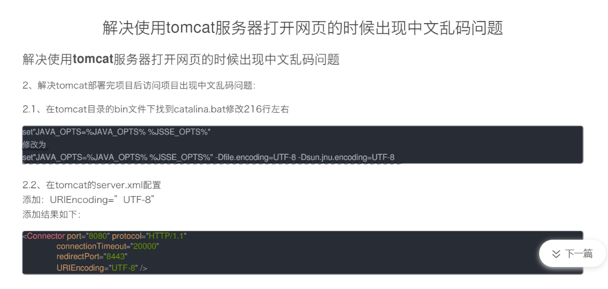
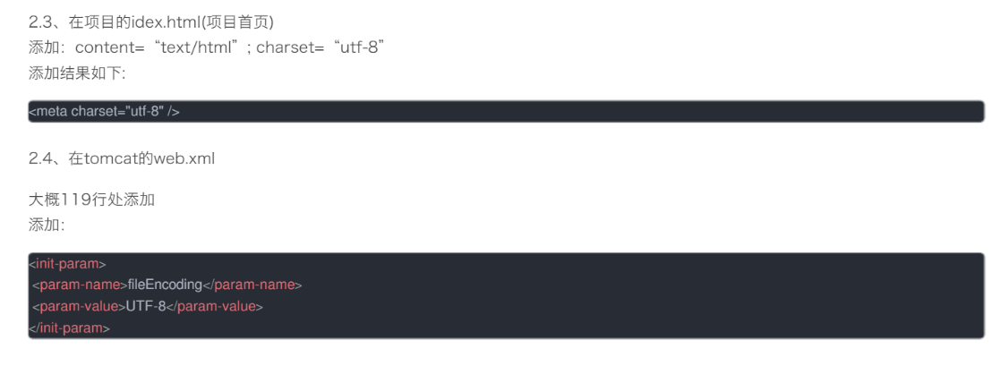
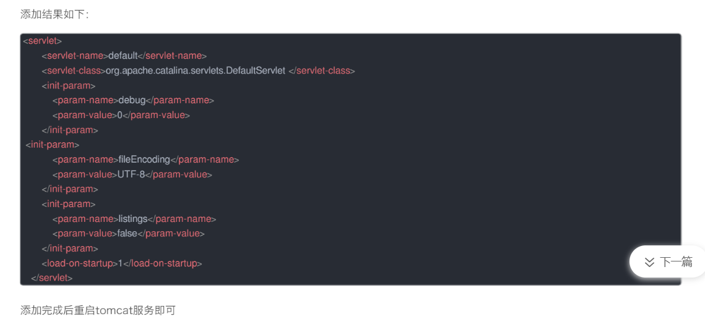

# properties和fields的区别

`properties`是有`getter`和`setter`的, 比如`xxx.properties`, 而`fields`是没有`getter`和`setter`的


# 获取request的参数(地址栏的参数)

> ==点击列表查看传到当前页面的数据, 如果地址栏中有特殊字符(%或者&)可能会获取不到==

```java
 <!--点击列表查看传到当前页面的数据, 如果地址栏中有特殊字符(%或者&)可能会获取不到 -->
        var pageParam = {};
        <%String[] pageParam = {"REPORT_NO","judgmentDesc","applicant4","checkDate","supplier","sendTo","makeCheckId","reportNo"
            ,"incomingDateInput","quantity","batch","materialNo","materialName"};
                for (int i = 0; i < pageParam.length; i++) {
                    String result = request.getParameter(pageParam[i]);
                    if (result != null) {
//                        result = new String(result.getBytes("ISO-8859-1"), "UTF-8");
                        pageContext.setAttribute(pageParam[i], result);
                    }
                    if (StringUtils.isNotEmpty(result)) {%>pageParam['<%=pageParam[i]%>'] = "<%=result%>";
        <%}
                    }%>
		//在jsp中可以这样直接获取pageContext作用域的值
        let judgmentDesc = "${judgmentDesc}"
```


# 汤姆猫乱码






