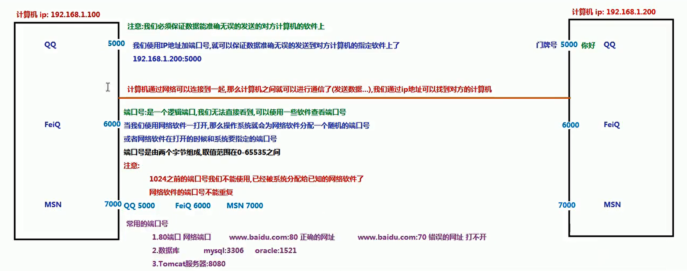
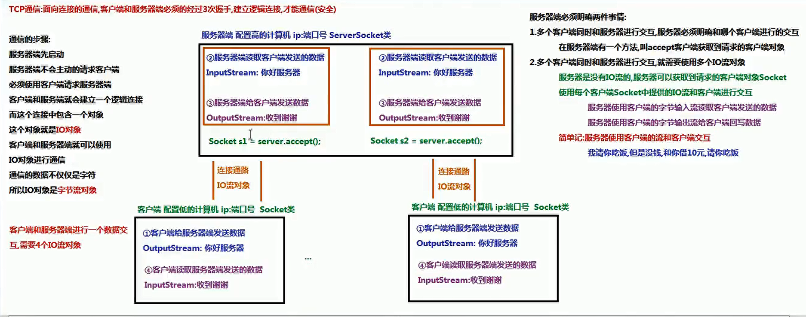
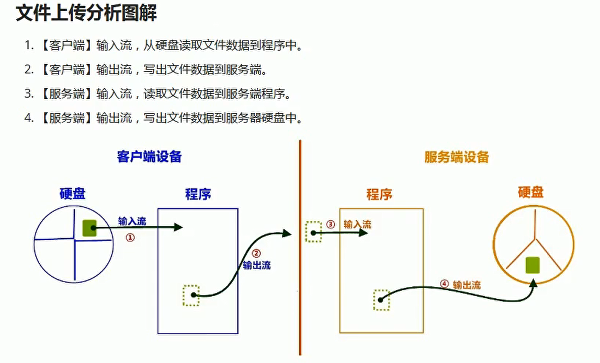

# 网络编程三要素

1. 协议
2. ip地址
3. 端口号




## 3次握手

通信步骤:

1. 服务器先启动

2. 客户端请求服务器

3. ==**客户端和服务器建立逻辑连接, 这个连接中包含一个对象, 这个对象就是io对象, 通信的数据不仅仅是字符, 所以这个io对象是字节流对象**==

   

   

   

   ## 文件上传小案例

   

   

   

   # 文件下载
   
   ```java
   @GetMapping("/download")
   public String download(HttpServletRequest request,
                          HttpServletResponse response) throws IOException {
       File file = new File("C:\\Users\\28348\\Desktop\\web\\README.md");
       try (FileInputStream inputStream = new FileInputStream(file);
            ServletOutputStream outputStream = response.getOutputStream();) {
           //            // 配置文件下载
   
   
           response.setHeader("content-type", "application/octet-stream");
           response.setContentType("application/octet-stream");
           // 下载文件能正常显示中文
           response.setHeader("Content-Disposition", "attachment;filename=" + URLEncoder.encode(file.getName(), "UTF-8"));
   
   
   
           response.setContentType("text/html;charset=utf-8");
   
           byte[] bytes = new byte[1024];
           int len = -1;
           while ((len = inputStream.read(bytes)) != -1) {
               outputStream.write(bytes, 0, len);
           }
           outputStream.flush();
   
       } catch (Exception e) {
           throw new EOFException("文件处理异常!");
       }
       return "ok";
   }
   ```
   
   

# 线程池

```java
import java.util.Timer;
import java.util.TimerTask;
import java.util.concurrent.ExecutorService;
import java.util.concurrent.Executors;
import java.util.concurrent.ScheduledExecutorService;
import java.util.concurrent.TimeUnit;
public class App {
    public static void main(String[] args) {


        //Executors: 调度器, ExecutorService: 用于管理线程池


        /*****************特点：无限大，如果线程池中没有可用线程就会自动创建，有的话就自动利用起来。************/

        ExecutorService executorService1 = Executors.newCachedThreadPool();//创建一个可缓存的线程池
        //可缓存线程池的特定: 无限大, 如果线程池中没有可用线程池就会自动创建, 有的话就会自动利用起来
        for (int i = 0; i < 10000; i++) {
            final int index = i;
            executorService1.execute(() -> {
                System.out.println(Thread.currentThread().getName() + ":" + index);
            });
        }
        System.out.println("嘤嘤嘤");
        executorService1.shutdown();//等待所有线程执行完毕之后关闭线程池


        /*********************************************************/

        //定长线程池的特点: 固定线程总数, 空闲线程用于执行任务. 如果线程都在执行任务后续后续任务则处于等待状态,
        //在线程池中的线程执行任务后再执行后续任务
        //如果线程处于等待状态, 备选的等待算法默认为FIFO或者LIFO


        ExecutorService executorService2 = Executors.newFixedThreadPool(3000);

        for (int i = 0; i < 10000; i++) {
            final int index = i;
            executorService2.execute(() -> {
                System.out.println(Thread.currentThread().getName() + ":" + index);
            });
        }
        System.out.println("嘤嘤嘤");
        executorService1.shutdown();//等待所有线程执行完毕之后关闭线程池


        /*****************************************************************************/
        //单线程池
        ExecutorService executorService3 = Executors.newSingleThreadExecutor();

        for (int i = 0; i < 10000; i++) {
            final int index = i;
            executorService3.execute(() -> {
                System.out.println(Thread.currentThread().getName() + ":" + index);
            });
        }
        System.out.println("嘤嘤嘤");
        executorService1.shutdown();//等待所有线程执行完毕之后关闭线程池


        /**************************************************************************************/
        //调度线程池
        ScheduledExecutorService scheduledExecutorService = Executors.newScheduledThreadPool(3);

        //延迟三秒执行一次
        scheduledExecutorService.schedule(() -> {
            System.out.println(Thread.currentThread().getName() + ":" + "延迟三秒执行一次");
        }, 3000, TimeUnit.MILLISECONDS);


        scheduledExecutorService.scheduleAtFixedRate(() -> {
            System.out.println(Thread.currentThread().getName() + ":" + "延迟三秒重复执行");
        }, 0, 3000, TimeUnit.MILLISECONDS);


        //定时调度器
        final int[] a = {10};
        Timer timer = new Timer();
        timer.scheduleAtFixedRate(new TimerTask() {
            @Override
            public void run() {
                System.out.println(a[0]++);
            }
        }, 1000,3000);

    }
}

```

