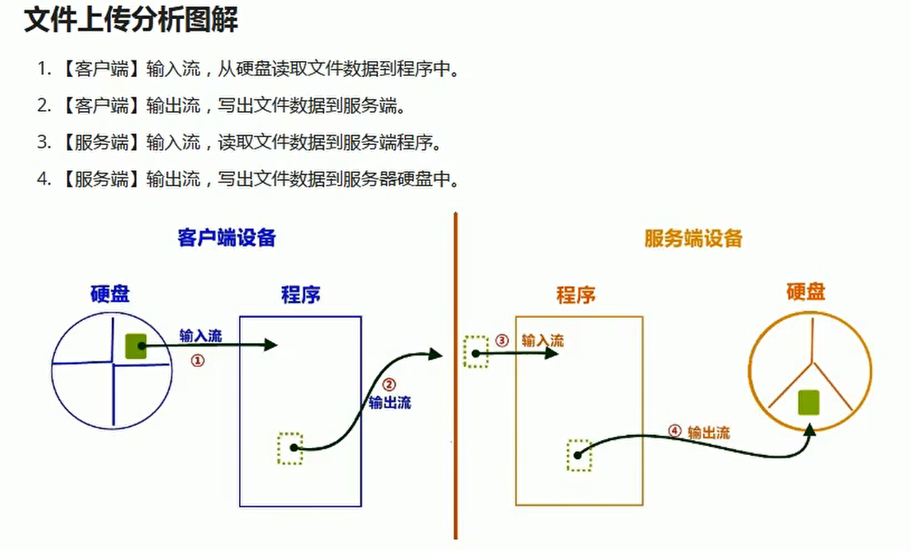
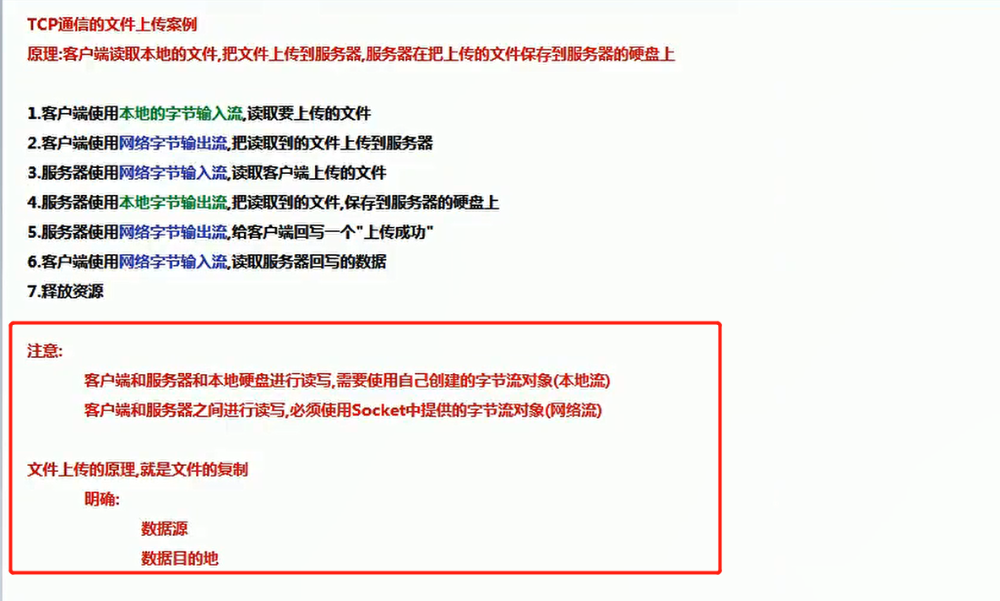

# 网络编程三要素

1. 协议
2. ip地址
3. 端口号


## 3次握手

通信步骤:

1. 服务器先启动

2. 客户端请求服务器

3. ==**客户端和服务器建立逻辑连接, 这个连接中包含一个对象, 这个对象就是io对象, 通信的数据不仅仅是字符, 所以这个io对象是字节流对象**==

   

   

   

   ## 文件上传小案例

   

   

   

   # 文件下载
   
   ```java
   @GetMapping("/download")
   public String download(HttpServletRequest request,
                          HttpServletResponse response) throws IOException {
       File file = new File("C:\\Users\\28348\\Desktop\\web\\README.md");
       try (FileInputStream inputStream = new FileInputStream(file);
            ServletOutputStream outputStream = response.getOutputStream();) {
           //            // 配置文件下载
   
   
           response.setHeader("content-type", "application/octet-stream");
           response.setContentType("application/octet-stream");
           // 下载文件能正常显示中文
           response.setHeader("Content-Disposition", "attachment;filename=" + URLEncoder.encode(file.getName(), "UTF-8"));
   
   
   
           response.setContentType("text/html;charset=utf-8");
   
           byte[] bytes = new byte[1024];
           int len = -1;
           while ((len = inputStream.read(bytes)) != -1) {
               outputStream.write(bytes, 0, len);
           }
           outputStream.flush();
   
       } catch (Exception e) {
           throw new EOFException("文件处理异常!");
       }
       return "ok";
   }
   ```
   
   

